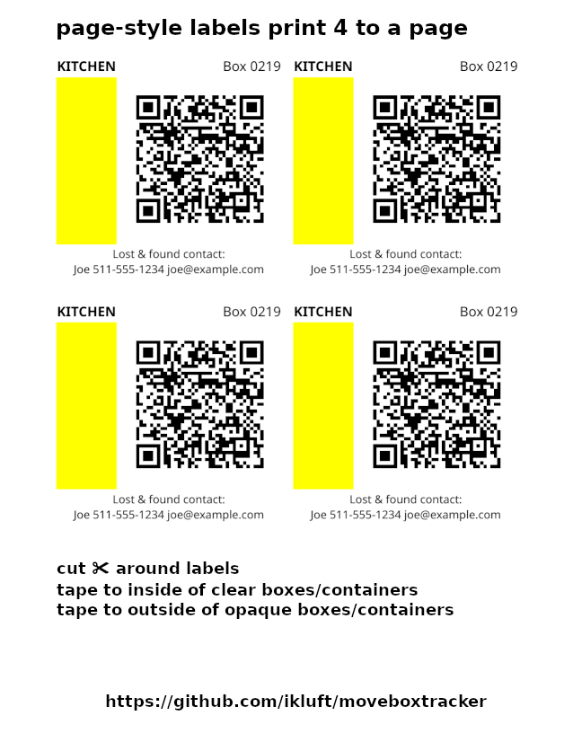
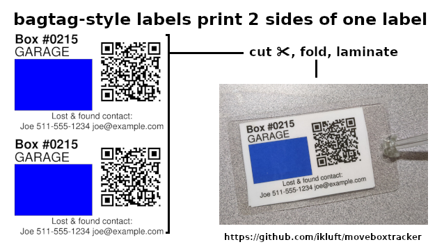

# "moveboxtracker" Project Description

The "moveboxtracker" project automates parts of moving box tracking including an inventory database
and label generation.

This is the command-line interface (CLI) for moveboxtracker.
It manages an SQLite database file containing moving) box data.
It prints labels, four to a page, including features I wanted for
tracking a move based on my experience and advice I found online.

A separate mobile app handles scanning the QR codes printed on the labels.

## Project overview

Features of the moving box labels:
* box number for database lookup
* room name and color to help unloading at the destination
  * color coding rooms is advice I found online, making it easier for helpers
* QR code for scanning for batches of boxes in each carload or truckload
* "lost & found" contact info, just in case
* set "MBT_PAGE_SIZE" environment variable to change page size (default: Letter)

Tables in the SQLite database:
* batch_move: each batch of boxes moved, time and destination
* box_scan: code scan event for a box being entered into a move batch
* image: storage of optional images for moving_box and item records
* item: description of one of multiple items in a box, optional image
* location: name of a location, such as origin, storage, destination, etc
* move_project: overall project info including title, primary user and lost&found contact
* moving_box: box info including origin/destination room, current location, optional image
* room: name of origin/destination room
* uri_user: name of a user as a namespace for URIs for scanning, who did each scan

Labels are printed with data from a query of the tables move_project, moving_box, room & uri_user.
There are two label formats: 4-up on a page, or a baggage tag.

Features of mobile app (upcoming):
* Android app
* QR code scanner using Quickie library https://github.com/G00fY2/quickie
* scans a batch of boxes into local SQLite db
* exports SQLite db for merge into central CLI-managed db
* maybe future expansion to control central db on Android if others want to help with that

There are currently no plans for an iOS app unless others want to help develop and maintain it.

## Command-line usage

The moveboxtracker CLI uses subcommands for different functions and database elements.
These are issued like "moveboxtracker <subcommand> <subcommand-args>"
At any level the --help parameter can show a list of subcommands and options.

The top-level subcommands are
- init:     initialize new moving box database
- batch:    create or update a batch record
- box:      create or update a moving box record
- image:    create or update an image record
- item:     create or update an item record
- location: create or update a location record
- room:     create or update a room record
- scan:     create or update a scan record
- user:     create or update a user record
- label:    print label(s) for specified box ids
- merge:    merge in an external SQLite database file, from another device
- dump:     dump database contents to standard output
- db:       low-level database access subcommands

In all the commands below, the database file name can be specified by either --db=filename
on the command line or by setting the MBT_DB_FILE environment variable before running the program.
Use of the environment variable allows setting it once instead of separately on every command.

Example:

    $ export MBT_DB_FILE=/path/to/movebox.db
    $ moveboxtracker db box read 1
    executing SQL [SELECT * FROM moving_box WHERE id == :id] with {'id': 1}
    ┌────┬──────────┬───────────┬──────┬──────┬───────┐
    │ id │ location │   info    │ room │ user │ image │
    ├────┼──────────┼───────────┼──────┼──────┼───────┤
    │ 1  │    1     │ MBR shoes │  2   │  1   │   1   │
    └────┴──────────┴───────────┴──────┴──────┴───────┘
    read 1 record(s)

### init subcommand

Before a database can be used, the SQLite database file needs to be initialized.
Any missing data fields will be filled via command-line prompt.
The usage is as follows:

    moveboxtracker init [-h] [--primary_user PRIMARY_USER] [--title TITLE] [--found_contact FOUND_CONTACT] DB

top-level options:
- -h, --help:           show help message and exit

data field options:
- --id ID:              record id number
- --primary_user PRIMARY_USER: primary user id to attach to scans
- --title TITLE:        project name
- --found_contact FOUND_CONTACT: lost+found contact information to display on labels
- DB:                   database file path to create and initilize

When created the database contains table definitions but no records in any of the tables.

### batch subcommand

The "batch" subcommand creates or modifies a batch record.
If an --id parameter is present, it modifies that record.
Otherwise it creates a new one.
When creating a new record, missing data fields will be filled via command-line prompt.

    moveboxtracker batch [-h] [--db DB] [--id ID] [--timestamp TIMESTAMP] [--location LOCATION] [--commit] [--list]

top-level options:
- -h, --help:           show help message and exit
- --db DB, --db_file:   DB database file (optional if MBT_DB_FILE is set in the environment)

data field options:
- --id ID:              record id number
- --timestamp TIMESTAMP: batch timestamp
- --location LOCATION:  batch location - where the boxes in this batch are moving to

action options: (actions to take instead of creating or updating a record)
- --commit:             update locations of boxes in this batch to the new location
- --list:               display a list of the batch records

It will prompt for required parameters which were not provided on the command line.
Location may be either a record id referring to the location table or the name of a location in that table,
in which case its record id will be retrieved.

See also the "db batch" subcommand for lower level but broader access to the database.

### box subcommand

The "box" subcommand creates or modifies a moving box record.
If an --id parameter is present, it modifies that record.
Otherwise it creates a new one.
When creating a new record, missing data fields will be filled via command-line prompt.

    moveboxtracker box [-h] [--db DB] [--id ID] [--location LOCATION] [--info INFO] [--room ROOM] [--user USER] [--image IMAGE] [--list]

top-level options:
- -h, --help:           show help message and exit
- --db DB, --db_file:   DB database file (optional if MBT_DB_FILE is set in the environment)

data field options:
- --id ID:              record id number
- --location LOCATION:  box location, changes when a batch this box belongs to gets moved
- --info INFO:          description of the box or unit
- --room ROOM:          id referring to room table, for printing on box label
- --user USER:          id referring to user table, originating user for printing on box label
- --image IMAGE:        id referring to image table (optional)

action options: (actions to take instead of creating or updating a record)
- --list:               display a list of the box records

See also the "db box" subcommand for lower level but broader access to the database.

### image subcommand

The "image" subcommand creates or modifies an image record.
If an --id parameter is present, it modifies that record.
Otherwise it creates a new one.
When creating a new record, missing data fields will be filled via command-line prompt.

    moveboxtracker image [-h] [--db DB] [--id ID] [--image_file IMAGE_FILE] [--description DESCRIPTION] [--timestamp TIMESTAMP] [--list]

top-level options:
- -h, --help:           show help message and exit
- --db DB, --db_file:   DB database file (optional if MBT_DB_FILE is set in the environment)

data field options:
- --id ID:              record id number
- --image_file IMAGE_FILE: relative or absolute path to the image file
- --description DESCRIPTION: description of the image
- --timestamp TIMESTAMP: time of the image, defaults to the current time at record creation

action options: (actions to take instead of creating or updating a record)
- --list:               display a list of the image records

See also the "db image" subcommand for lower level but broader access to the database.

### item subcommand

The "item" subcommand creates or modifies an item record.
If an --id parameter is present, it modifies that record.
Otherwise it creates a new one.
When creating a new record, missing data fields will be filled via command-line prompt.

    moveboxtracker item [-h] [--db DB] [--id ID] [--box BOX] [--description DESCRIPTION] [--image IMAGE] [--list]

top-level options:
- -h, --help:           show help message and exit
- --db DB, --db_file:   DB database file (optional if MBT_DB_FILE is set in the environment)

data field options:
- --id ID:                   record id number
- --box BOX:                 id number of the box which contains the item
- --description DESCRIPTION: description of the image
- --image IMAGE:             optional image of the item, as a path to a file or index into the image table

action options: (actions to take instead of creating or updating a record)
- --list:               display a list of the item records

See also the "db item" subcommand for lower level but broader access to the database.

### location subcommand

The "location" subcommand creates or modifies a location record.
If an --id parameter is present, it modifies that record.
Otherwise it creates a new one.
When creating a new record, missing data fields will be filled via command-line prompt.

    moveboxtracker location [-h] [--db DB] [--id ID] [--name NAME] [--list]

top-level options:
- -h, --help:           show help message and exit
- --db DB, --db_file:   DB database file (optional if MBT_DB_FILE is set in the environment)

data field options:
- --id ID:              record id number
- --name NAME:          room name string

action options: (actions to take instead of creating or updating a record)
- --list:               display a list of the location records

See also the "db location" subcommand for lower level but broader access to the database.

### room subcommand

The "room" subcommand creates or modifies a room record.
If an --id parameter is present, it modifies that record.
Otherwise it creates a new one.
When creating a new record, missing data fields will be filled via command-line prompt.

    moveboxtracker room [-h] [--db DB] [--id ID] [--name NAME] [--color COLOR] [--list]

top-level options:
- -h, --help:           show help message and exit
- --db DB, --db_file:   DB database file (optional if MBT_DB_FILE is set in the environment)

data field options:
- --id ID:              record id number
- --name NAME:          room name string
- --color COLOR:        color name string, which must be a valid web color

action options: (actions to take instead of creating or updating a record)
- --list:               display a list of the room records

See also the "db room" subcommand for lower level but broader access to the database.

### scan subcommand

The "scan" subcommand creates or modifies a scan record, for recording a movement of a box.
If an --id parameter is present, it modifies that record.
Otherwise it creates a new one.
When creating a new record, missing data fields will be filled via command-line prompt.

    moveboxtracker scan [-h] [--db DB] [--id ID] [--box BOX] [--batch BATCH] [--user USER] [--timestamp TIMESTAMP] [--list | --boxes BOXID [BOXID ...]]

top-level options:
- -h, --help:           show help message and exit
- --db DB, --db_file:   DB database file (optional if MBT_DB_FILE is set in the environment)

data field options:
- --id ID:              record id number
- --box BOX:            id number of the box which is being moved
- --batch BATCH:        id number of the batch group which the box will move along with
- --user USER:          id referring to user table, originating user who scanned the box or entered its scan data, defaults to the database's default user
- --timestamp TIMESTAMP: time of the scan, defaults to the current time at record creation

action options: (actions to take instead of creating or updating a record)
- --list:               display a list of the room records
- --commit:             commit the batch move by updating the location of all boxes in the batch to the batch location (requires or will prompt for --id)

See also the "db scan" subcommand for lower level but broader access to the database.

### user subcommand

The "user" subcommand creates or modifies a user record.
If an --id parameter is present, it modifies that record.
Otherwise it creates a new one.
When creating a new record, missing data fields will be filled via command-line prompt.

    moveboxtracker user [-h] [--db DB] [--id ID] [--name NAME] [--list]

top-level options:
- -h, --help:           show help message and exit
- --db DB, --db_file:   DB database file (optional if MBT_DB_FILE is set in the environment)

data field options:
- --id ID:              record id number
- --name NAME:          user name string, email address recommended

action options: (actions to take instead of creating or updating a record)
- --list:               display a list of the room records

See also the "db user" subcommand for lower level but broader access to the database.

### label subcommand

Printing a label from the database requires providing the database file, a box ID number and a PDF output file. From the database it will also retrieve the lost/found contact info, room name and room color code. Labels are printed duplicated 4 times on a page to have enough to place on 4 sides of a moving box. If more than one box ID number is provided, one page will be made for each set of labels. The resulting PDF file can be sent to any standard printer.

    moveboxtracker label [-h] [--db DB] [--type [TYPE]] [--outdir LABELDIR] ID [ID ...]

top-level options:
- -h, --help:           show help message and exit
- --db DB, --db_file:   DB database file (optional if MBT_DB_FILE is set in the environment)

label generation options:

- --type TYPE:            type of label to generate:
  - "page" for a full page with 4 labels (default)
  - "bagtag" for a baggage tag sized label (2 sides to be folded over) which can be laminated into a baggage tag
- --outdir LABELDIR:      directory to place new label PDF files
- ID:                     box record id number (like 23) or range of numbers (like 23-28, no spaces around the dash)

By default moveboxtracker generates PDF output for US Letter size pages. To use a different page size, set the MBT_PAGE_SIZE environment variable before running the script. For example, to use A3 size pages, set "export MBT_PAGE_SIZE=A3" in your shell or its rc setup script before running moveboxtracker.

### merge subcommand

The merge subcommand is not yet implemented. It will collect data from another SQLite database made by the moveboxtracker program or app into the one used by this instance. In particular this is intended as intake for data from the moveboxtracker Android app.

### dump subcommand

The dump subcommand prints out the contents of the SQLite database file. The path to the database file is a required parameter.

    moveboxtracker dump [-h] [--db DB]

top-level options:
- -h, --help:           show help message and exit
- --db DB, --db_file:   DB database file (optional if MBT_DB_FILE is set in the environment)

### db subcommand

The db subcommand provides direct access to the database tables with create, read, update or delete (“CRUD”)
operations. 

    moveboxtracker db [-h] {batch,box,image,item,location,project,room,scan,user} {create,read,update,delete} ...

The database tables are:
* batch: batch/group of moving boxes
* box: moving box including label info
* image: images for boxes or items
* item: item inside a box
* location: location where boxes may be
* project: overall move project info
* room: room at origin & destination
* scan: box scan event on move to new location
* user: user who owns database or performs a box scan

Each of the tables supports command-line options named for fields in order to set values.
Fields are required if the database defines them with a "NOT NULL" constraint.

#### batch table

Each record in the batch table is a group of boxes moved together.
They should be added to the batch as they are loaded into the vehicle.

    moveboxtracker db batch [-h] [--db DB] [--timestamp TIMESTAMP] [--location LOCATION] {create,read,update,delete} [id]

#### box table

Each record in the box table is either a moving box or some other labeled item.
For the database's purposes, everything that gets tracked and has a label is simplified to be called a box.
Any labelled thing, whether or not it is actually a box, will be tracked in the database as a box.
For example, a framed picture or a chair also get a label with a "box" number.

    moveboxtracker db box [-h] [--db DB] [--location LOCATION] [--info INFO] [--room ROOM] [--user USER] [--image IMAGE] {create,read,update,delete} [id]

Things that go inside a box are in the item table.

#### image table

Each record in the image table describes a photo, stored in a directory named from the basename of the database
with a "-images" suffix.
It also has a hash to recognize if the same image is already in the database.
A field for the MIME type tells what kind of image it is, and allows looking up what program can display it.
Images in this table can be referenced by ID from the box or item tables.

    moveboxtracker db image [-h] [--db DB] [--image_file IMAGE_FILE] [--hash HASH] [--mimetype MIMETYPE] [--encoding ENCODING] [--description DESCRIPTION] [--timestamp TIMESTAMP] {create,read,update,delete} [id]

#### item table

Each record in the item table is something that goes inside a box. Each item has a required reference to the box
that contains it, required description text and an optional reference to an image of the item.

    moveboxtracker db item [-h] [--db DB] [--box BOX] [--description DESCRIPTION] [--image IMAGE] {create,read,update,delete} [id]

#### location table

Each record in the location table is a place where boxes can be at any stage of a move operation.
Likely examples would be the origin, one or more storage or staging areas, and the destination.
The only field (other than the record ID number) is a text name.
The name needs only to be meaningful to the people working on the move.

    moveboxtracker db location [-h] [--db DB] [--name NAME] {create,read,update,delete} [id]

#### project table

The project contains only one record which is the core configuration of the project.
It contains a title string, a reference to the primary user in the uri_user table,
and a found-contact string to print on moving box labels.
There is no "id" field because there is only one record.

    moveboxtracker db project [-h] [--db DB] [--primary_user PRIMARY_USER] [--title TITLE] [--found_contact FOUND_CONTACT] {create,read,update,delete} [id]

#### room table

Each record in the room table represents a location at the origin and corresponding location at the destination.
It's usually a room but doesn't necessarily have to be.
After the integer primary key field, there are also name and color fields.
The name field is a string which will should be short because it will be printed on each box label in large font.
The color is a color code for the box labels to make them easier to recognize where to unload them to.

    moveboxtracker db room [-h] [--db DB] [--name NAME] [--color COLOR] {create,read,update,delete} [id]

#### user table

Each record in the user table represents a user who can enter data or scan boxes.
This is intended for when merging a database from a mobile device which did scanning.
Any batches of baxes moved by that device's user will be marked as scanned by them.
The name needs to be a unique string.
It is recommended to use the email address of the primary user of the mobile device,
or another string which uniquely represents that person and that device.

    moveboxtracker db user [-h] [--db DB] [--name NAME] {create,read,update,delete} [id]
