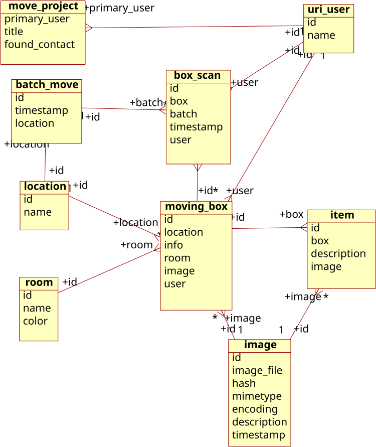
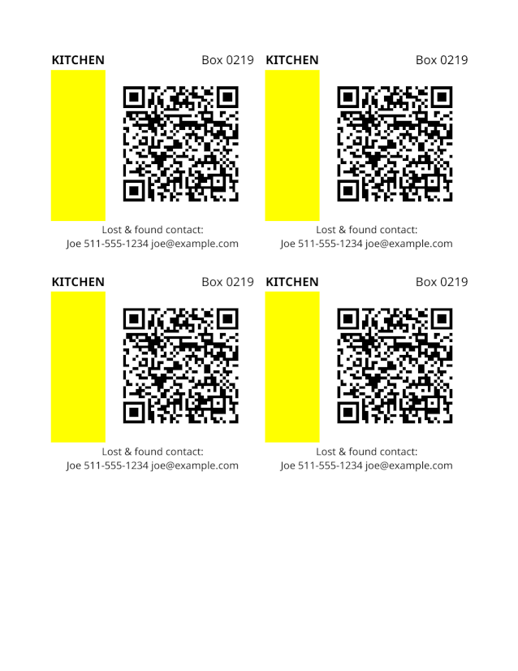

# moveboxtracker
moving box tracking: inventory database, label generation, barcode scanner

This is a work in progress.
* The [command-line interface](cli/) is working for database manipulation and label generation
* The Android app has not been started yet. It will consist of a QR code scanner and camera input to the moving box database.

## database entity relationship diagram

## example moving labels

